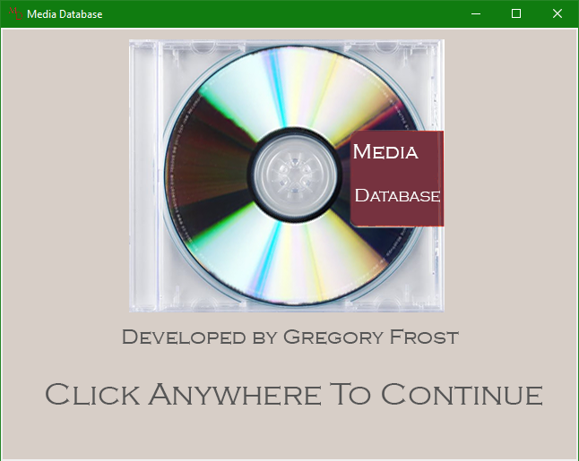
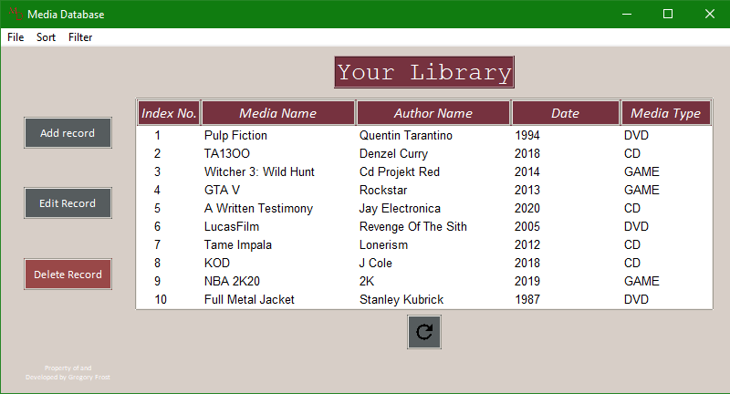
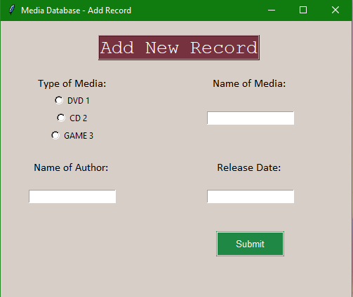
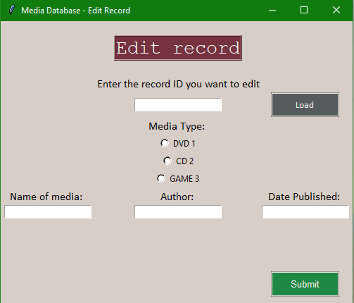
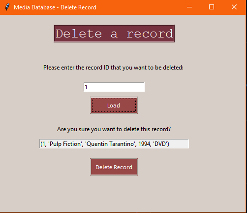
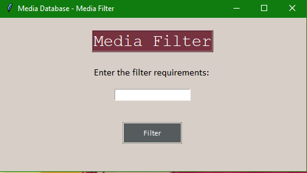
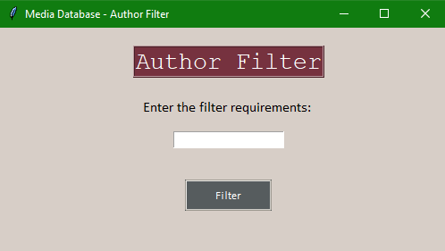

# Media Database
A fully python based media database where users can keep track of the DVDs, CDs, and games that they own.

This is a very basic database that stores data after the program quits, and can edit, delete, sort and filter items in the database.

## Screenshots
Splash Screen:

Main Menu

Add Record

Edit Record

Delete Record

Media Filter

Author Filter

