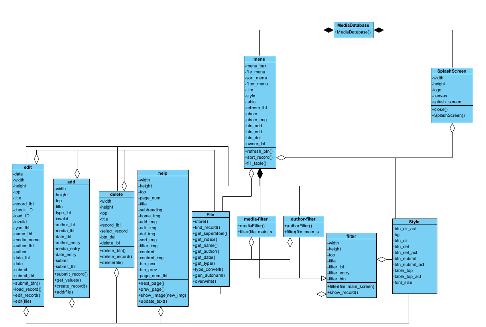

# Documentation
This is the file where all the documentation for this repository will go

## System Design
Below is a class diagram of the project

Summary:

The program runs through the MediaDatabase class which instantiates a splash screen and menu object. There is then a separate class for each top level window. The Style class is like a helper class it has no objects it only stores the styling values used throughout.